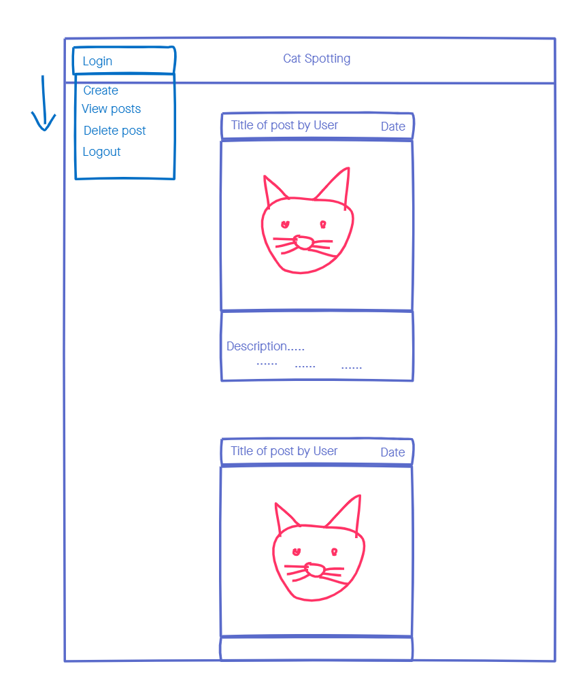

# "🐈Catspotting🐈"
### *A place to share pictures of cats that have randomly crossed your path*
## Project Overview
In this second GA SEI project, we had to create both a back-end database server and a front-end web application for users to be able to send, edit, 

## Wireframes

The wireframe was pretty straight forward and simple, much like the webpage itself. There's almost no deviations from it, including the drop-down menu. Though all other menus were just sort of made on the fly.

## User Stories
* When a user (ideally two) visits the page, they should be greeted with the simple options of either reading the rules or starting a game
* When the user feels ready to begin the game, they should click a button to open the game board up
* The user should get information about their score and power-up abilities for the game.
* When the use is ready to begin a round, they press a play button that would play the sound sample, though no immediately, as to give them time to prepare for it since it is only one second of song that plays
* When a user wants to answer, they should press on their respective key (as explained in the rules but also visually guided to them from the player board), and should get confirmation that they have successfully buzzed in by their box changing color.
* When a user wants to use a powerup, they should see if they are able to use their desired power up
    * If they want to use a nail, they will buzz in and press the nail use, and their opponent's box will change color (though different than the players)
    * if they want to use their 50/50, they will see two options disappear. If they want to select an answer now, they only have two options, all other key inputs will be ignored.
* After each round, points are given. If they player wants to continue, they press the play button again to repeat the process.

## Technologies used
* MongoDB - Database to store and retrieve posts and user accounts.
* Heroku - Cloud server to deploy web application
* Node.js - Used to build network/web application with JavaScript
* Node Packages include:
* * express - To run a http server to route paths and send responses
* * dotenv - To use environment files to use private parameters
* * ejs - Allow to for express to render html pages with variables sent server-side
* * method-override - Allow the use of other methods such a DELETE
* * mongoose - Allow the use of interacting with MongoDB to read and write database information
* * express-session - Have user sessions that allow certain member features/access
* * bcrypt - Provide encryption/decryption for passwords in database
* * "bcrypt": "^5.0.0",
* Google Maps API - Provided visual services for location of where users can report where they spotted a cat.
* JavaScript: Main language in building the server, as well as setting listeners to manipulate the DOM
* jQuery/jQueryUI: Provided some menu effects
* HTML/CSS: Markup for the front-end as well as providing visual style
* Google Fonts: External fonts

## Approaches taken

## Known Bugs
* Haven't found any yet though I'm sure they're there

## compatibility/Installation Guide
* Tested to work on Chrome and Firefox
* No additional installation required

## Things To Add

## Closing Comments
